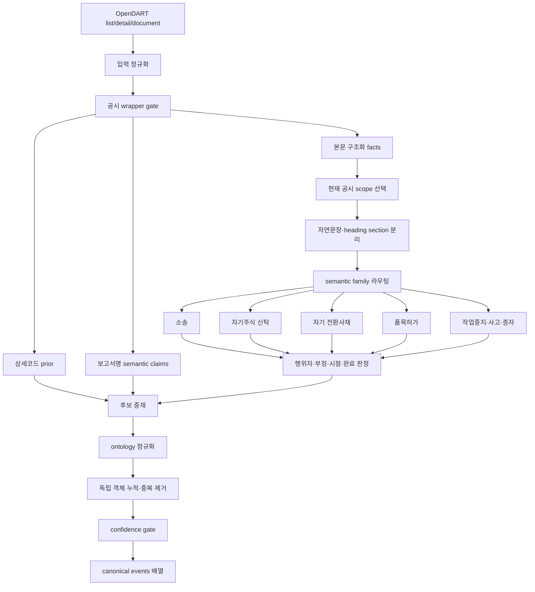

# OpenDART 공시 캐노니컬 이벤트 추출 고도화 완료 보고서

- 작성일: 2026-07-24
- 대상 저장소: `jaroo-mvp-v3`
- 작업 브랜치: `release`
- 기준 HEAD: `44ab6f4`
- 최종 추출기 버전: `jaroo.kr-disclosure-event-extractors.gated.v3`
- 최종 모듈 SHA-256: `13c953c1ab69c71c0d4507ad0aff7c024f2005c4c53b8d50fb2ef193dbe8af04`
- 상태: **추출기 구현 및 목표 품질 게이트 통과 / 사용자 DeepScan 경로 통합은 미완료**
- 실행 원칙: 최종 개발·검증 단계는 OMX 명령 없이 Codex CLI 네이티브 도구와 독립 네이티브 검증 에이전트만 사용

---

## 1. 경영진 요약

이번 작업은 OpenDART가 제공하는 공시 메타데이터를 Jaroo 내부의 5필드 캐노니컬 이벤트로 변환하는 기능을, 단순 제목 키워드 분류기에서 **본문의 행위자·대상·부정·시점·실행 여부·복수 사건을 함께 해석하는 의미 게이트**로 확장한 작업이다.

최종 출력 계약은 다음과 같다.

```ts
events: Array<{
  type: string;
  action: string | null;
  state: string | null;
  cause: string | null;
  subjectType: string | null;
}>;
```

핵심 결론은 다음과 같다.

1. OpenDART는 위 캐노니컬 객체를 직접 제공하지 않는다. 상세분류코드, 보고서명, 정정 wrapper, 본문을 Jaroo가 해석해 `events[]`를 구성해야 한다.
2. 공시 하나가 이벤트 하나라는 가정을 폐기했다. 서로 독립적인 소송, 신탁, 자기 CB, 품목허가 사건을 한 공시에서 여러 이벤트로 보존한다.
3. ML을 먼저 도입하지 않았다. 결정론적 캐노니컬 계약, 시간·부정·행위자·객체 경계를 먼저 정리한 결과 목표 품질을 달성했다.
4. 최종 독립 정성평가에서 유효 계약 **57/57**, 고신뢰 이벤트 **43/43**, 고신뢰 커버리지 **63.158%**를 기록했다.
5. 기존 기본 게이트 69건, 별도 burned 게이트 36건, Round 8 잠금셋 60건도 모두 정확 일치했다.
6. 다만 `gated.v3`는 현재 테스트·벤치마크에서만 호출된다. 사용자 DeepScan은 아직 기존 `buildKrDisclosurePipeline`의 metadata 기반 분류를 사용하므로, 이번 완료 범위는 **추출기 구현·검증까지**이며 제품 연결·배포는 후속 작업이다.

### 최종 판정

| 목표 | 기준 | 최종 결과 | 판정 |
|---|---:|---:|---|
| 유효 계약 의미 정확도 | ≥ 90% | **57/57, 100%** | PASS |
| 고신뢰 이벤트 정밀도 | ≥ 95% | **43/43, 100%** | PASS |
| 고신뢰 커버리지 | ≥ 35% | **36/57, 63.158%** | PASS |
| Round 8 잠금셋 | 회귀 없음 | **60/60** | PASS |
| Burned v4 | 회귀 없음 | **36/36** | PASS |
| 기본 semantic gate | 회귀 없음 | **69/69** | PASS |

> 주의: 2026-07-21 연구의 160개 template 평가와 최종 Round 9의 57개 유효 계약은 서로 다른 평가셋이다. `76.9% → 100%`를 동일 holdout에서의 직접 상승치로 해석하면 안 된다. 최종 수치는 잠금된 clean-room 계약에 대한 결과이며, 시장 전체 정확도나 금융·법률 전문가 ground truth 100%를 의미하지 않는다.

---

## 2. 작업 배경과 초기 품질 문제

### 2.1 초기 구조의 장점

기존 구조는 다음 순서로 공시를 좁혀 가는 계층형 접근을 사용했다.

```text
OpenDART 상세분류코드
        ↓
구조화된 공시 제목 규칙
        ↓
필요 시 본문 제목 필드
        ↓
canonical event
```

상세분류코드 기반 type 라우팅과 provider provenance는 안정적이었다. 그러나 5개 필드 전체의 의미 정확도는 type 정확도와 별개였다.

### 2.2 초기 독립 정성평가

2026-07-21 연구에서 160개 고유 제목 template을 독립 검토한 결과는 다음과 같았다.

| 지표 | 결과 |
|---|---:|
| 완전 정답 | 123/160, 76.9% |
| 핵심 사건은 맞지만 필드 부정확 | 16/160, 10.0% |
| 핵심 오분류 | 19/160, 11.9% |
| 근거 부족 | 2/160, 1.3% |
| `high`인데 완전 정답이 아닌 사례 | 36/159, 22.6% |

이 결과는 다음 사실을 드러냈다.

- `coverage=100%`는 정답률이 아니다.
- 필드를 모두 채웠다는 사실은 의미 정확성을 보장하지 않는다.
- 상세코드로 type을 맞혀도 action, state, cause, subjectType은 틀릴 수 있다.
- 잘못된 이벤트를 `high`로 내보내는 confidence calibration 문제가 컸다.
- 본문의 결정일, 예정일, 완료일, 정정 내용, 거래 대상과 행위자를 읽지 않으면 실행 전 계획을 완료 사건으로 오인한다.

### 2.3 반복된 대표 오류

| 오류 축 | 대표 실패 |
|---|---|
| 시간 | 다음 달 취득 결정을 이미 취득 완료로 변환 |
| filing/event 혼합 | 정정 wrapper를 event lifecycle로 사용 |
| 행위자 | 제3자의 CB 매입을 발행회사의 자기 CB 취득으로 오인 |
| 대상 | 한 제품의 취하를 다른 제품의 계속 심사 문구가 상쇄 |
| 부정 | `취하하지 않았다`, `사실이 아니다`를 긍정 취하로 오인 |
| 현재성 | 과거 종결 사건을 현재 active 이벤트로 재생성 |
| 복수성 | 서로 다른 CB 회차 또는 소송을 하나의 lifecycle로 합침 |
| 중복 lifecycle | 신규 소장 접수에 `filed`와 `active`를 동시에 생성 |
| confidence | 근거가 약한 fallback까지 모두 `high`로 반환 |

---

## 3. 목표와 완료 조건

### 3.1 제품 목표

OpenDART의 상세분류코드, 보고서명, 정정 정보, 본문을 사용해 공시가 실제로 전달하는 사건을 다음 단위로 추출하는 것이 목표였다.

```text
event = type × action × state × cause × subjectType
```

한 공시에서 독립 사건이 여러 개라면 각각 별도 객체로 반환한다.

```ts
events: [
  {
    type: 'legal-regulatory',
    action: 'filed',
    state: null,
    cause: 'litigation',
    subjectType: 'issuer',
  },
  {
    type: 'capital-change',
    action: 'decided',
    state: 'proposed',
    cause: 'treasury-share-trust',
    subjectType: 'securities',
  },
]
```

### 3.2 품질 목표

- 유효 계약 의미 정확도 90% 이상
- 고신뢰 이벤트 정밀도 95% 이상
- 고신뢰 커버리지 35% 이상
- 기존 기본·burned·이전 라운드 회귀 없음
- 특정 접수번호나 회사명 literal에 의존하지 않는 일반화 규칙
- sealed holdout을 수정 루프에서 열지 않음
- 평가 케이스를 실행 전에 잠그고 SHA로 무결성 확인
- 정량 지표뿐 아니라 독립 검증 에이전트의 사건별 정성 판정 수행

---

## 4. 최종 처리 아키텍처



### 4.1 핵심 설계 변화

기존의 “제목에서 하나의 event를 고른다”는 구조를 다음과 같이 바꿨다.

```text
문서 전체
  → 현재 의미 scope
  → 독립 section
  → section별 family
  → section별 actor/object/polarity/lifecycle
  → 독립 events 누적
  → canonical 정규화 및 confidence gate
```

이 변화로 같은 family의 서로 다른 lifecycle도 보존할 수 있게 됐다.

예시:

```text
제4회 자기 CB: 대금·권리 이전 완료
제6회 자기 CB: 다음 달 매입 결정, 미결제
```

```ts
events: [
  { action: 'acquired', state: 'effective', cause: 'convertible-bond' },
  { action: 'decided', state: 'proposed', cause: 'convertible-bond' },
]
```

---

## 5. 주요 구현 내용

### 5.1 현재 scope와 과거 이력 분리

다음 문구를 현재 이벤트 증거에서 제외하거나 별도 경계로 처리했다.

- 과거 이력, 종전 내역, 이전 사례
- 참고사항, 단순 연혁, 별건 연혁
- 정정 전 값과 정정 후 값
- 이미 종료된 사건 또는 과거 취득 자산

반대로 `현재`, `금번`, `이번`, `계속 중`, `유지` 같은 현재성 표지는 operative scope를 다시 연다.

이를 통해 과거 소송·과거 CB·재신청 완료 이력이 현재 이벤트로 재생성되는 문제를 막았다.

### 5.2 자연문장과 heading 기반 section 분리

본문에 `[소송]`, `[신탁]` 같은 명시적 heading이 없어도 다음 신호로 독립 section을 구성한다.

- `첫째`, `둘째`, `셋째`
- `별도로`, `이와 독립하여`, `한편`, `또한`
- `제4회`, `제6회` 같은 CB 회차
- `제1호`, `제2호` 같은 신탁 객체
- 문장 종결점과 숫자 소수점의 구분

특히 문장 뒤에 연도가 바로 오는 경우도 소수점으로 오인하지 않고 문장 경계로 처리했다.

### 5.3 소송 lifecycle

구현된 핵심 판정은 다음과 같다.

| 본문 의미 | canonical 결과 |
|---|---|
| 소장 제출·법원 접수 | `filed / null` |
| 변론·심리·청구 계속 | `updated / active` |
| 전부 취하·법원 접수·효력 발생 | `withdrawn / effective` |
| 취하 계획·검토 | active 또는 보류 |
| 취하 요청 반려·번복 | active |
| 확정판결 후 추가 절차 없음·종결 | active 제거 |
| 제3자 사건이며 issuer 비당사자 | 소송 이벤트 억제 |

같은 사건 section 안에서 `withdrawn > filed > active` 우선순위를 적용해 신규 소장 접수에 `filed`와 `active`가 중복 생성되는 것을 막았다. 독립 section의 서로 다른 사건은 그대로 복수 이벤트로 남긴다.

### 5.4 자기주식취득 신탁

다음 상태를 구분한다.

- 이사회 결의, 서명 전, 체결 예정 → `decided / proposed`
- 전자서명, 날인, 계약서 교환, 효력 발생 → `contracted / effective`
- 연장 변경계약 서명 완료 → `contracted / effective`
- 철회·취소·사실무근·issuer 비당사자 → 기존 긍정 이벤트 억제

`계약 예정이었다`는 과거 문구 뒤에 현재 전자서명 완료가 나오면 현재 완료 증거가 우선한다.

### 5.5 자기 전환사채 취득

다음 세 축을 함께 판정한다.

1. **행위자**: 매수인이 발행회사인지 제3자인지
2. **실행성**: 대금 지급, 결제, 사채권 인도, 권리 이전이 끝났는지
3. **잔존 객체**: 외부 잔액, 잔여분, 일부 회차가 남았는지

| 본문 의미 | canonical 결과 |
|---|---|
| 전액 결제·권리 이전·외부 잔액 없음 | `acquired / effective` |
| 다음 달 매입 결정·미결제 | `decided / proposed` |
| 일부만 매입·외부 잔존 | `decided / proposed` |
| 과거 보유 CB의 현재 재매각 계획 | 신규 취득 이벤트 억제 |
| 제3자·관계회사 매입 | issuer 자기 CB 이벤트 억제 |
| 취득 결정 철회·실제 취득 없음 | 긍정 CB 이벤트 억제 |

`취득`, `인수`, `매수`, `매입` 표현을 동일한 의미 가족으로 처리하되, 완료 부정과 부분 실행 증거를 별도로 확인한다.

### 5.6 품목허가 신청 취하

단순히 `취하`라는 단어가 있다고 event를 만들지 않는다.

필요한 긍정 증거:

- issuer가 신청인 또는 제품 보유자
- 품목허가·의약품허가·신약허가 신청과 연결
- 취하서 접수, 수리, 심사 취소·종료, 자진취하 확정

억제 조건:

- 취하설 부인, 사실무근
- 취하하지 않음, 심사 계속
- 취하 검토·예정·조건부
- 관계회사·종속회사·제3자의 신청
- 취하 요청 반려·무효·서류 회수
- 다른 제품의 유지 문구가 앞 제품 취하와 독립인 경우

여러 제품이 한 문장에 있어도 제품 A의 완료 취하와 제품 B의 계속 심사를 서로 상쇄하지 않도록 객체 경계를 추가했다.

### 5.7 복수 이벤트 누적

generic 또는 복수 의미 보고서명에서 다음 조합을 하나의 문서로 처리한다.

- 소송 취하 + 신탁 추진
- 신규 소송 + 신탁 결정
- 신탁 체결 + 자기 CB 취득
- 소송 + 신탁 + CB + 품목허가 취하
- 소송 정정 + 독립 증자 일정 변경

중복 제거는 전체 type 하나만 남기는 방식이 아니라 5필드 event tuple 기준으로 수행한다.

### 5.8 literal 과적합 방지

소스 테스트는 다음 패턴이 semantic gate에 들어가지 않도록 고정한다.

- 특정 OpenDART 접수번호 literal
- 특정 `corpName`
- 특정 `receiptNumber` 또는 `rceptNo` 비교 분기

개별 사례 ID를 외우는 대신 문장 구조, lifecycle, actor, object, polarity 규칙으로 일반화했다.

---

## 6. 구현 규모

### 6.1 핵심 구현 diff

| 파일 | 추가 | 삭제 | 역할 |
|---|---:|---:|---|
| `deepscan-kr-disclosure-event-extractors.js` | 705 | 46 | semantic gate 및 family별 추출 규칙 |
| `deepscan-kr-disclosure-event-extractors.test.cjs` | 990 | 0 | 회귀·메타모픽·독립 평가 계약 |
| **합계** | **1,695** | **46** | 핵심 구현 및 테스트 |

현재 핵심 파일 규모:

| 파일 | 행 | 바이트 |
|---|---:|---:|
| 추출기 | 3,259 | 205,908 |
| 추출기 테스트 | 2,323 | 154,829 |

### 6.2 추가된 주요 helper

- `currentDisclosureScope`
- `issuerLitigationClauses`
- `classifyLitigationClause`
- `litigationLifecycleEvent`
- `hasTerminalProductWithdrawal`
- `hasAffirmativeRegulatoryWorkStop`
- `explicitSectionFamily`
- `isIndependentNaturalSection`
- `explicitBodySections`
- `hasExplicitEquityScheduleDelta`
- `explicitTrustEvent`
- `explicitConvertibleBondEvent`
- `explicitFiledLitigationEvent`
- `isThirdPartyOnlyLitigation`
- `isFalseLitigationReport`
- `isConcludedLitigationWithoutWithdrawal`
- `applyExplicitBodyIntentRule`

### 6.3 연구·벤치마크 기반

| 산출물 | 역할 |
|---|---|
| `opendart-disclosure-progress-2026-07-20.html` | 개발 현황 발표 자료 |
| `opendart-event-extraction-research-2026-07-21.md` | 초기 품질 연구 및 구조적 원인 분석 |
| `audit-dart-disclosure-classification.mjs` | OpenDART 상세유형·시장별 표본 감사 |
| `benchmark-dart-disclosure-event-extractors.mjs` | 후보 추출기 비교 |
| `benchmark-dart-disclosure-event-research.mjs` | research corpus 평가 |
| `benchmark-dart-disclosure-semantic-gate.mjs` | exact-set·confidence·coverage 품질 게이트 |
| `collect-dart-disclosure-event-research-corpus.mjs` | 본문 연구 corpus 수집 |
| `kr-disclosure-event-benchmark.v1.json` | 대조 benchmark fixture |
| `kr-disclosure-event-body-reviewed.v1.json` | 본문 의존 reviewed fixture |
| `kr-disclosure-event-semantic-gate.v1.json` | 기본 semantic gate fixture |

---

## 7. 반복 개발 및 피드백 루프

### 7.1 전체 방식

각 라운드는 다음 순서를 따랐다.

```text
독립 반례 작성 또는 잠금셋 생성
        ↓
현재 public extractor 실행
        ↓
정량 exact-set 평가
        ↓
독립 에이전트 정성 검토
        ↓
계약 오류와 extractor 오류 분리
        ↓
일반화된 최소 규칙 수정
        ↓
이전 라운드 + burned + 기본 게이트 재실행
```

### 7.2 라운드별 핵심 주제

| 단계 | 핵심 주제 |
|---|---|
| Iteration 5 | lifecycle, fallback, polarity, object taxonomy |
| Iteration 6 | field-scoped evidence, unsupported correction calibration |
| Iteration 7 | semantic family, polarity, lifecycle, cardinality |
| Iteration 7b | near-miss, current scope, relation, sibling cardinality |
| Iteration 8 | scoped lifecycle repair와 sibling intent 누적 |
| Iteration 8 actuality | 예정·과거 증거 배제, 한국어 완료 표현 수용 |
| Iteration 8 metamorphic | 중립 문장 거리·순서 변화에도 결과 불변 |
| Round 2 | current actor, actuality role, sibling cardinality |
| Round 3 | current span 재진입, lifecycle 병합 |
| Round 4 | actor, object, ordered polarity, current island |
| Round 5 | alias, 후속 계획, 규제 행위자 |
| Round 6 | heading 없는 정정, 문장 단위 actor |
| Round 7 | generic 제목에서 복수 명시적 body intent 누적 |
| Round 8 | 자연문장 속 독립 사건 lifecycle 분리 |
| Round 9 | 행위자·객체·독립 회차·복수 제품·혼합 사건 최종 보강 |

### 7.3 Round 9 실패에서 최종 통과까지

초기 Round 9 평가에는 evaluator ontology alias와 입력 계약 문제도 섞여 있었다. 별도 contract critic이 60건을 재검토해 다음처럼 분리했다.

- 유효 계약: 57건
- 계약 또는 입력이 무효: 2건
- 모호: 1건
- 최초 유효 계약 정확도: 33/57, 57.895%
- 최초 고신뢰 이벤트 정밀도: 23/37, 62.162%

유효 extractor 결함은 다음 축에 집중됐다.

- 소송 진행·취하 lifecycle
- 신탁 연장 계약
- 자기 CB 실행 전·부분 실행·제3자·철회
- 제품 승인·취하·제3자·재신청
- 복수 사건 누적과 과거 이력 격리

최종 수정 후 동일 잠금 유효 계약 결과:

- 의미 정확도: 57/57
- 고신뢰 이벤트 정밀도: 43/43
- 고신뢰 케이스 정밀도: 36/36
- 고신뢰 커버리지: 36/57

---

## 8. 평가 계약과 방어 장치

### 8.1 잠금셋 무결성

Round 9 케이스는 실행 전에 잠겼다.

- 케이스 파일: `/tmp/jaroo-native-semantic-review-round9-cases.json`
- 케이스 수: 60
- Canonical SHA-256: `fe4bbb8ef5caecc559d614426cad5f176780ada2af1d20c869a07d4aa7e5fa2a`
- primary 평가 유효 계약: 57

최종 검증 에이전트는 다음 제한을 지켰다.

- public export `extractEventsGatedProjection`만 실행
- 구현 소스와 저장소 테스트를 읽지 않음
- 이전 최종 recheck 결과를 읽지 않음
- sealed holdout에 접근하지 않음
- 저장소 파일을 수정하지 않음
- OMX를 사용하지 않음

### 8.2 exact-set 기준

positive 사례는 5필드 event tuple의 정확한 집합 일치를 요구한다.

- 누락 event 실패
- 추가 event 실패
- 같은 event 중복 실패
- 필드 하나가 달라도 실패
- `other`로 보류하면 positive exact-set 실패

negative control은 금지 tuple이 하나라도 방출되면 실패한다.

### 8.3 confidence anti-gaming

다음 전략으로 점수를 높일 수 없도록 별도 테스트를 두었다.

- 전부 abstain
- 전부 `other`
- 필드 누락
- 정답에 extra event 추가
- 모든 결과를 low confidence로 낮춤
- 동일 template 반복으로 micro accuracy 부풀림

---

## 9. 최종 품질 결과

### 9.1 독립 Round 9 정성평가

| 지표 | 성공/전체 | 결과 |
|---|---:|---:|
| 유효 계약 의미 정확도 | 57/57 | **100%** |
| 고신뢰 이벤트 정밀도 | 43/43 | **100%** |
| 고신뢰 케이스 정밀도 | 36/36 | **100%** |
| 고신뢰 커버리지 | 36/57 | **63.158%** |

### 9.2 Round 8 잠금셋

| Family | 정확도 | 고신뢰 정밀도 | 고신뢰 커버리지 |
|---|---:|---:|---:|
| Litigation | 12/12 | 8/8 | 66.7% |
| Treasury trust | 12/12 | 9/9 | 75.0% |
| Own CB | 12/12 | 8/8 | 66.7% |
| Multi-event | 12/12 | 11/11 | 91.7% |
| Product withdrawal | 12/12 | 6/6 | 50.0% |
| **합계** | **60/60** | **42/42** | **70.0%** |

### 9.3 기존 게이트 회귀 확인

| Gate | Exact-set | Field accuracy | High precision | High coverage | 결과 |
|---|---:|---:|---:|---:|---|
| Burned v4 | 36/36 | 100% | 22/22, 100% | 61.11% | PASS |
| Default semantic gate | 69/69 | 100% | 50/50, 100% | 72.46% | PASS |

Wilson 95% 하한:

- Burned exact-set: 0.9036
- Burned high-confidence precision: 0.8513
- Default exact-set: 0.9473
- Default high-confidence precision: 0.9287

---

## 10. 코드 검증 결과

### 10.1 통과 항목

| 검증 | 결과 |
|---|---|
| Round 9 저장소 회귀 테스트 | PASS |
| 추출기 전체 top-level 테스트 | **40/40 PASS** |
| Round 8 recheck | **60/60 PASS** |
| Round 9 deterministic recheck | **57/57 PASS** |
| Round 9 독립 정성평가 | **PASS** |
| Burned v4 | **36/36 PASS** |
| Default semantic gate | **69/69 PASS** |
| Targeted ESLint | PASS |
| Crawler syntax `check` | PASS |
| `git diff --check` | PASS |

주요 검증 명령:

```bash
node --test packages/crawler/test/deepscan-kr-disclosure-event-extractors.test.cjs
npm exec -- eslint \
  packages/crawler/src/services/deepscan-kr-disclosure-event-extractors.js \
  packages/crawler/test/deepscan-kr-disclosure-event-extractors.test.cjs
npm --workspace @jaroo/crawler run check
npm --workspace @jaroo/crawler test
```

### 10.2 전체 crawler 테스트의 timing 예외

현재 장기 실행 작업경로에서 전체 crawler 테스트는 240건 중 239건이 통과했다. 유일한 실패는 변경 영역과 무관한 다음 벽시계 assertion이었다.

```text
buildJarooDeepScanPayload returns partial pending committee at soft deadline
assert.ok(Date.now() - startedAt < 70)
```

진단 결과:

- 같은 현재 코드를 깨끗한 임시 실행경로에서 단독 실행하면 PASS
- 현재 source patch를 깨끗한 HEAD worktree에 적용한 상태에서도 PASS
- 실패한 기존 작업경로에는 누적 진단 로그와 I/O 부하가 존재
- 기능 assertion이 아니라 70ms 미만이라는 환경 민감 벽시계 assertion만 실패

따라서 이번 event extractor 변경의 기능 회귀 증거로 판단하지 않았다. 다만 CI 안정성을 위해 향후 이 테스트는 fake clock 또는 I/O 분리 방식으로 개선하는 것이 좋다.

---

## 11. 최종 검증 산출물

아래 `/tmp` 파일은 최종 검증 증거이며 임시 파일시스템에 있다. 장기 보존이 필요하면 별도 artifact 저장소로 이동해야 한다.

| 산출물 | SHA-256 |
|---|---|
| `jaroo-native-semantic-review-round8-recheck.json` | `fad4cdb512a30dd42b7e6a9874b2807c69c11305cbe828d2b67abc5ed8365d22` |
| `jaroo-native-semantic-review-round9-recheck.json` | `cc4e509d23aafaabc4b77e96bfe58c76533e919c31d6945375aab03caf0297f6` |
| `jaroo-native-semantic-review-round9-final-qualitative.json` | `007a61f5d4b620b6ad4f8282eedc914bf63bb1caa2e1bf9068d3b0c1623f54f6` |
| `jaroo-opendart-burned-v4-result-native-final.json` | `832a6c5ac5f4c90eb7758ce4e6e245d362e8d285425b9757c060f4e5c4d6d07f` |
| `jaroo-opendart-default-result-native-final.json` | `4cd2831be2a05402821cea10e71df834d7abedb677e493d7daa83fa5fbd678ed` |

최종 정성평가 보고서가 확인한 module SHA는 저장소에서 재계산한 값과 일치한다.

---

## 12. 핵심 기술 결정

### 12.1 지금 당장 ML 분류기를 만들지 않은 이유

초기 오류 대부분은 모델 부족보다 계약과 경계 규칙의 문제였다.

- filing state와 event state가 섞임
- planned와 effective 전이 조건이 없음
- actor와 subject가 섞임
- 한 문서 안의 독립 객체가 합쳐짐
- negative·historical 문구가 positive current 증거로 사용됨

이 상태에서 ML을 먼저 붙이면 잘못 정의된 label을 학습하고, 설명 가능성과 회귀 통제가 약해질 가능성이 높다.

결정론적 계층을 먼저 고친 결과 목표 품질을 달성했기 때문에, ML/LLM은 다음 경우에만 제한적으로 고려하는 것이 적합하다.

- generic form이면서 구조화 필드가 부족한 경우
- 결정론적 규칙 간 충돌이 있는 경우
- `other` 또는 low confidence로 보류된 장문 비정형 사례

### 12.2 억지 필드 완성보다 보류 우선

틀린 `high` 이벤트보다 `other` 또는 low confidence가 낫다. 이번 품질 게이트는 coverage만 높이는 방식이 아니라 고신뢰 precision을 함께 강제했다.

### 12.3 한 공시 다중 이벤트

공시 하나가 하나의 객체라는 제약을 두지 않았다. 결과의 단위는 문서가 아니라 **독립 semantic event**다.

### 12.4 본문 전체 keyword scan 대신 scope·section·family

전건 자유본문에서 모든 단어를 섞어 판정하지 않는다.

1. 현재 scope를 선택한다.
2. 독립 section을 나눈다.
3. section family를 정한다.
4. 해당 family 전용 lifecycle 규칙만 적용한다.

이 구조가 교차 오염을 줄이는 핵심이었다.

---

## 13. 남은 제한과 위험

### 13.1 저위험 semantic 공백

최종 독립 검증에서 primary 지표에는 영향을 주지 않지만 다음 공백이 남았다.

| ID | 현재 동작 | 남은 문제 |
|---|---|---|
| P03 | IND 취하를 product approval로 오인하지 않고 low-confidence fallback | 실제 withdrawal lifecycle을 더 정확히 표현할 수 있음 |
| T10 | 철회된 신탁 계획을 active/effective로 남기지 않음 | 명시적 철회 자체가 `other`로 축소됨 |
| C09 | 철회된 CB 계획을 active/effective로 남기지 않음 | 명시적 철회 자체가 `other`로 축소됨 |

현재 캐노니컬 계약에서 `cancelled decision`을 어떤 action/state로 표현할지 먼저 합의한 뒤 확장하는 것이 안전하다.

### 13.2 평가 범위

- Round 9는 clean-room 잠금셋이지만 금융·법률 전문가가 확정한 전체 시장 ground truth는 아니다.
- 유효 계약 57건은 주요 취약 family에 집중된 적대적 표본이며 전체 OpenDART 분포를 대표하지 않는다.
- 기본·burned fixture는 개발 과정에서 반복 사용했으므로 독립 미래 holdout이 아니다.
- 완전한 시장 품질 주장을 위해서는 규칙을 동결한 뒤 다음 기간 공시로 temporal holdout을 수행해야 한다.

### 13.3 유지보수 복잡도

추출기 파일은 3,259행으로 커졌다. 현재는 행동을 잠그기 위한 회귀 규칙이 우선이었지만, 다음 단계에서는 테스트를 유지한 채 family별 모듈로 분리하는 편이 좋다.

권장 분리안:

```text
disclosure-events/
  scope.js
  sections.js
  litigation.js
  treasury-trust.js
  convertible-bond.js
  regulatory-product.js
  arbitration.js
  confidence.js
```

이 리팩터링은 기능 추가와 분리해 진행하고, 기존 40개 top-level 테스트와 모든 잠금 게이트를 그대로 통과해야 한다.

### 13.4 작업 트리 상태

본 보고서를 포함한 구현·테스트·research script·fixture·문서는 `release` 브랜치 반영 대상으로 정리했다. 사용자 경로 통합과 배포는 이 커밋 범위에 포함하지 않는다.

### 13.5 사용자 경로 통합 공백

현재 production source에서 `extractEventsGatedProjection`을 import하는 곳은 없다. 사용자 DeepScan 경로는 `buildKrDisclosurePipeline`이 만드는 `primaryCategory`, 위험도, metadata-only `materialEvents`를 사용한다.

사용자 체감 효과를 만들려면 다음 연결이 별도로 필요하다.

```text
선별 OpenDART filing
  → 필요한 본문 확보
  → extractEventsGatedProjection
  → filing.canonicalEvents
  → deepscan-kr-evidence
  → committee/insight/payload
  → 사용자 화면
```

따라서 본 보고서의 100% 지표는 검증된 extractor의 정확도이며, 현재 배포된 사용자 화면의 공시 분류 정확도를 뜻하지 않는다.

---

## 14. 권장 후속 작업

### P0 — 완료 결과 보존

1. `/tmp` 최종 평가 JSON을 지속 보존 가능한 위치로 복사한다.
2. 구현, 테스트, 연구 산출물을 논리적 커밋으로 분리한다.
3. 한국어 PR 설명에 본 보고서와 품질 지표를 연결한다.

### P1 — Temporal holdout

1. 현재 규칙과 fixture를 동결한다.
2. 다음 기간 신규 KOSPI 공시를 수집한다.
3. 상세코드·제목·본문을 포함해 이중 독립 라벨링한다.
4. type/action/state/cause/subjectType 및 confidence calibration을 별도 측정한다.

### P1 — 철회 lifecycle 계약

다음 표현을 위한 canonical 계약을 먼저 확정한다.

```ts
{
  action: 'withdrawn' | 'cancelled',
  state: 'cancelled' | 'effective',
  cause: 'treasury-share-trust' | 'convertible-bond'
}
```

계약 확정 전에는 현재처럼 잘못된 active/effective를 내보내지 않는 보수적 fallback이 더 안전하다.

### P2 — 모듈 분리

family별 파일 분리와 공통 polarity/temporal utility 추출을 수행한다. 새 dependency는 필요하지 않다.

### P2 — ML/LLM fallback 연구

결정론적 gate가 low confidence 또는 `other`를 반환한 사례만 별도 queue에 보내고 다음을 비교한다.

- 규칙 기반 abstain 유지
- 소형 supervised classifier
- LLM structured extraction
- 규칙 + model arbitration

평가 기준은 coverage 단독이 아니라 exact-set, high-confidence precision, calibration, 비용, latency를 함께 사용해야 한다.

---

## 15. 최종 결론

이번 작업의 가장 큰 성과는 공시 제목을 분류하는 규칙을 늘린 것이 아니다. OpenDART 원문을 Jaroo 캐노니컬 이벤트로 바꾸는 문제를 다음 다섯 개의 독립 축으로 다시 정의하고, 이를 실행 가능한 gate와 회귀 계약으로 만든 것이다.

```text
현재성
× 행위자
× 대상 객체
× polarity
× lifecycle
```

그 결과 다음 상태에 도달했다.

- 복수 독립 사건을 `events[]`로 보존
- 계획과 실행 완료를 분리
- 제3자 행위와 issuer 행위를 분리
- 과거 이력과 현재 사건을 분리
- 취하·철회·부정·번복을 순서대로 판정
- exact-set과 confidence를 함께 품질 게이트로 사용
- 독립 clean-room 평가에서 목표 정확도·정밀도·커버리지 모두 통과

따라서 **현재 정의된 주요 semantic family와 유효 Round 9 계약 범위에서는 구현 목표를 달성했다.** 다음 단계의 중심은 규칙을 더 무작정 늘리는 것이 아니라, 완료 결과 보존, 미래 시점 holdout, 철회 lifecycle 계약 확정, family별 모듈 분리다.
